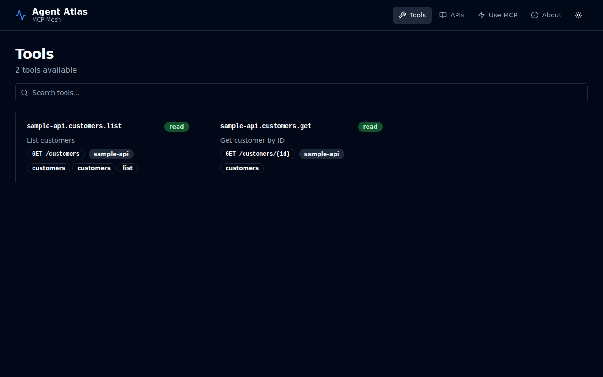
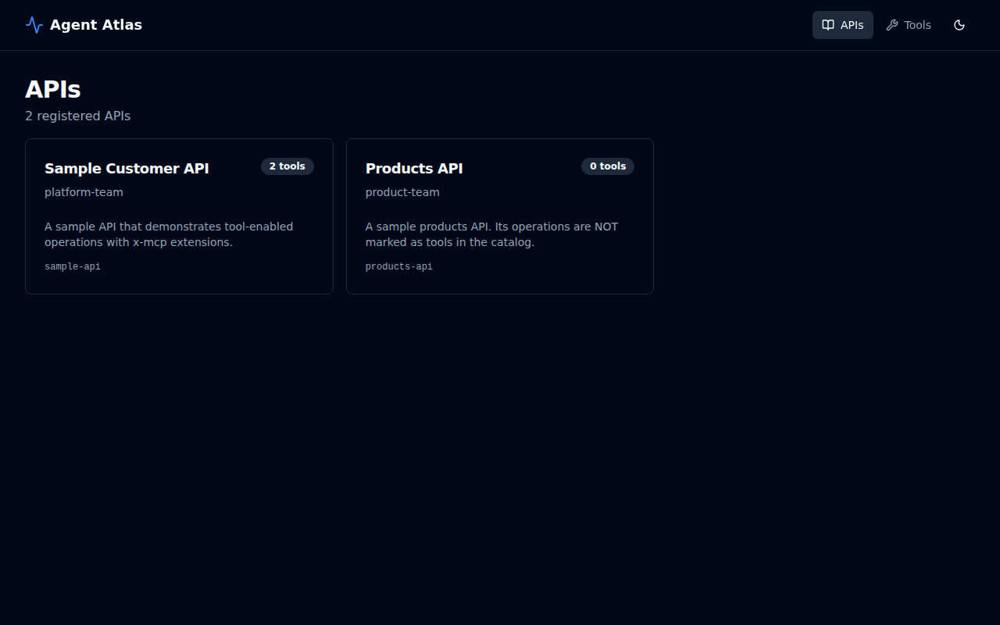
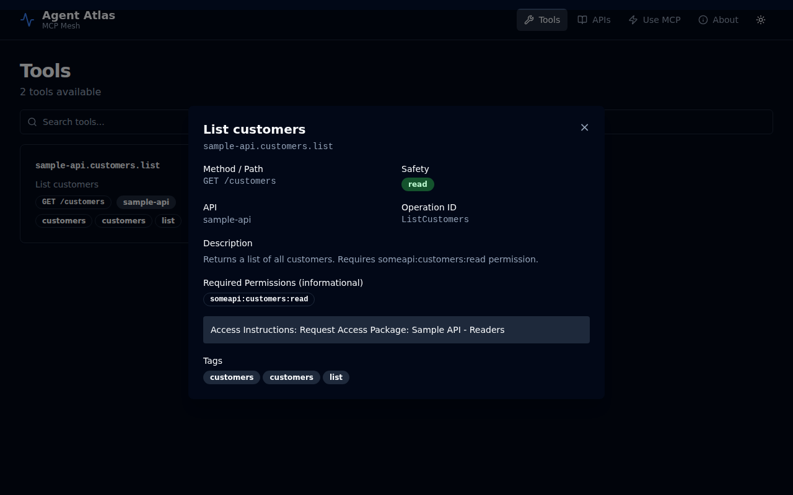

# Agent Atlas

Agent Atlas is an internal **map of capabilities** for your organisation's APIs, designed for the world where people and software agents (Microsoft Copilot, internal assistants, automation bots) need to reliably discover and use your systems — without tribal knowledge.

In most enterprises, APIs exist everywhere but they're hard to use safely at scale. Teams publish endpoints, docs drift, permissions are unclear, and when an agent or developer wants to "do the thing" — create an order, look up meters, retrieve a customer record — they need to know which service owns it, what the inputs look like, what permissions are required, and how to chain calls together. Agent Atlas turns that sprawl into an operationally governed product: a single catalog that tells humans and agents _"these are the tools our organisation offers,"_ and a secure proxy that can execute those tools using the caller's existing identity.

---

## What problem does it solve?

### 1 — Capability discovery

Even in mature organisations, people struggle to answer basic questions: _"Which API can do X?"_, _"What's the endpoint for Y?"_, _"Which service team owns it?"_, _"Is it safe to call?"_, _"What do I need access to?"_ Documentation lives in wikis, runbooks, and scattered OpenAPI files, and quickly becomes out of date.

### 2 — Making APIs usable by agents

Agents don't work well with random documentation or large, messy API surfaces. They need a structured way to discover and call operations — what the operation is, what parameters are required, and what it returns. Agent Atlas presents your API capabilities explicitly as **tools** that an agent can search and invoke, while keeping the control of authorisation with the owning team.

### 3 — Governance without bureaucracy

Enterprises need approvals, audit trails, and predictable change control — but they also need speed. Agent Atlas uses **GitOps principles**: changes to what is published as "agent tools" are made via pull requests, reviewed, and then deployed. The tool catalog is part of the same engineering discipline as code.

---

## What it is, in plain terms

Agent Atlas is **two things packaged as one product**.

### A catalog

A curated inventory of the APIs and endpoints that your organisation considers "agent-ready." Teams publish OpenAPI specs into a shared **data plane repository**. Within those specs they mark the endpoints they want exposed as tools and document what permissions are required. Agent Atlas reads that repository and materialises a searchable catalog of tools.

### A proxy that speaks MCP "Code Mode"

Agents like Copilot increasingly use a protocol called **MCP (Model Context Protocol)** to interact with tools. Instead of exposing hundreds of tools individually, Agent Atlas provides a small, stable interface:

- **Search** for tools by intent ("meters", "create offer", "customer lookup")
- **Describe** a tool (inputs, outputs, safety tier, required permissions)
- **Execute** a plan that invokes one or more tools in sequence

This keeps agent interactions predictable and scalable even as your API estate grows.

---

## How teams publish tools

Teams don't register endpoints through a web form or admin UI. They contribute in the same way they contribute code:

1. Submit an OpenAPI spec (or update) to the organisation's **Atlas data plane** Git repository.
2. In the spec, tag certain operations as tools and include metadata: stable tool name, safety tier (`read` / `write` / `destructive`), and required scopes/roles.
3. A pull request is reviewed and approved (platform team or CODEOWNERS).
4. On merge, the Atlas deployment is updated so the catalog reflects the new state.

This is a strong governance model: auditable, reviewable, and reversible. Rollbacks are just Git/Helm rollbacks.

```yaml
# openapi.yaml excerpt — marking an operation as a tool
paths:
  /customers:
    get:
      operationId: ListCustomers
      x-mcp:
        enabled: true
        name: "my-api.customers.list"
        safety: read
        requiredPermissions:
          - "my-api:customers:read"
        entitlementHint: "Request access via the My API - Readers access package"
        tags: [customers, list]
```

---

## How users and agents consume it

### For people

A simple read-only UI answers:

- What APIs are registered?
- What tools are available?
- What endpoints do they map to?
- What permissions do they require?
- Who owns them?

This is the **capability map** for the organisation — useful for onboarding, cross-team integration, and operational clarity.

### For agents (Copilot, internal assistants, automation)

Agent Atlas exposes an **MCP interface** where an agent can:

- Search for tools by intent.
- Retrieve structured details about a tool (inputs, outputs, safety tier, required permissions).
- Execute multi-step calls using a plan (list items, loop over results, fetch details).

Instead of navigating thousands of APIs or brittle documentation, the agent has a consistent tool surface across the entire enterprise.

---

## Security model: safe by design, without becoming a bottleneck

Agent Atlas is deliberately **not** the place where business authorisation decisions happen — that stays inside the APIs owned by the teams. However, it still enforces two things:

### 1 — Atlas authenticates and authorises use of Atlas itself

To use the catalog or execute tools, callers must present valid OIDC tokens issued by your identity provider. Atlas enforces platform-level permissions:

| Permission | Required for |
|------------|-------------|
| `platform-code-mode:search` | Searching/browsing the tool catalog |
| `platform-code-mode:execute` | Executing tool plans |

This prevents Atlas from being used as an open relay.

### 2 — Atlas passes the caller's token through to the downstream API

When an agent executes a tool, Atlas forwards the caller's JWT to the downstream API. The downstream API then enforces the real business permissions. Atlas does not "grant access" to data — it routes the authenticated caller's request.

This keeps ownership aligned: the platform team owns discovery and safe proxying; product teams own authorisation and data protection.

```
Caller → [Atlas JWT validation] → [Platform permission check] → [Execute plan]
                                                                      ↓
                                                          [Downstream API]
                                                     [Enforces its own auth]
```

### Why published required scopes/roles still matter

Even though Atlas doesn't enforce downstream permissions, declaring them is high-value:

- Makes permissions **transparent** — users can see what they need to request.
- Supports **self-service** — _"you're missing X; request access package Y."_
- Improves **agent behaviour** — an agent can choose tools the user likely has access to, or explain why an action failed.

Atlas can optionally compute "likely accessible" tools by comparing declared permissions against what appears in the caller's token claims. This remains best-effort and informational, but is a powerful UX improvement.

---

## Operational fit in enterprises

Agent Atlas is designed to be portable and works naturally in:

- **AKS** deployments via Helm
- **GitLab** pipelines that redeploy Atlas on PR merge
- **OIDC** configuration supplied via Kubernetes secrets (KeyVault integration)
- **Calico** network policies restricting where Atlas can call

But the product is not tied to AKS or Entra: it is an OIDC-enabled service that can run anywhere — Docker, Kubernetes, or directly on a VM.

---

## Why it matters strategically

From a product and executive perspective, Agent Atlas is an **enabling platform** for the next operating model of software delivery:

- **Agents will be a major interface** to enterprise systems, not just dashboards and internal UIs.
- **Discoverability and consistency** become a foundational capability: without it, agent adoption will be chaotic, brittle, and unsafe.
- **GitOps governance** ensures you can scale tool exposure without a centralised admin bottleneck.
- **Reduced integration friction** means faster delivery: teams don't need to know everything; they can find it.

Think of it as the **service catalog** concept (like Backstage) but optimised for agent tool use: not just _"what services exist,"_ but _"what actions can be performed safely, and how."_

### What success looks like

In a mature deployment, Agent Atlas becomes the default answer to:

- _"Can we do this through an API?"_
- _"Which endpoint is the approved one?"_
- _"What do I need to request access to?"_
- _"How can Copilot/agents safely operate our systems?"_

It enables consistent agent experiences across domains, shared patterns for tool annotation and publication, and measurable tool usage and reliability improvements over time.

**Agent Atlas turns a messy API estate into an organised, governed set of capabilities that both humans and AI agents can use safely and efficiently.**

---

## UI screenshots

The read-only UI is the **capability map** for your organisation — a single place for developers, operators, and AI agents to discover what tools are available, who owns them, and what access is required.

**Tools list (light mode)** — browse all registered tools with safety tier, method/path, and tags at a glance:


**Tool detail** — click any tool to see the full metadata including description, required permissions, and the entitlement hint that tells users exactly how to request access:


**Dark mode** — all views support light and dark themes:



**APIs list** — all registered APIs with owner, tool count, and API ID:

| Light | Dark |
|-------|------|
|  |  |

**Tool detail (dark mode)**:



---

## Technical overview

### Architecture

```
┌─────────────────────────────────────────────────────────────┐
│  AI Agent (Claude, Copilot, custom orchestrator, …)         │
│  ─ connects via MCP Streamable HTTP transport               │
└──────────────────────┬──────────────────────────────────────┘
                       │  Bearer JWT (Keycloak / any OIDC IdP)
                       ▼
┌─────────────────────────────────────────────────────────────┐
│  Atlas.Host  (ASP.NET Core 10, .NET Aspire)                 │
│                                                             │
│  ┌─────────────────────────────────────────────────────┐   │
│  │  MCP Server  (/mcp — ModelContextProtocol SDK)      │   │
│  │  • SearchTools   • DescribeTool   • ExecutePlan     │   │
│  └──────────────────────┬──────────────────────────────┘   │
│                          │                                  │
│  ┌─────────────────────┐ │ ┌──────────────────────────┐    │
│  │  Catalog REST API   │ │ │  Execution Engine         │    │
│  │  /v1/apis           │ │ │  (plan DSL interpreter)   │    │
│  │  /v1/tools          │ │ │  call / foreach / if      │    │
│  └─────────────────────┘ │ └──────────────────────────┘    │
│                          │                                  │
│  ┌─────────────────────────────────────────────────────┐   │
│  │  Catalog Loader  (reads GitOps data-plane repo)     │   │
│  │  OpenAPI + x-mcp vendor extension → ToolDefinition  │   │
│  └─────────────────────────────────────────────────────┘   │
│                                                             │
│  React UI (browse APIs & tools, dark/light mode)            │
└──────────────────────┬──────────────────────────────────────┘
                       │  Bearer JWT forwarded as-is
                       ▼
        Your existing REST APIs (unchanged)
```

### The data-plane (GitOps catalog repo)

```
catalog/
├── catalog.yaml              # Global org metadata
├── apis/
│   ├── my-api/
│   │   ├── api.yaml          # API identity, base URL, environments
│   │   └── openapi.yaml      # OpenAPI 3.x spec + x-mcp extensions
│   └── ...
└── policies/
    └── defaults.yaml         # Platform-level policy overrides
```

### MCP tools exposed to AI agents

| Tool | Purpose |
|------|---------|
| `SearchTools` | Search the catalog by query, API ID, safety tier, or access filter |
| `DescribeTool` | Get full metadata for a specific tool (schema, permissions, examples) |
| `ExecutePlan` | Run (or dry-run) a JSON plan against one or more tools |

#### Plan DSL

```json
{
  "steps": [
    { "type": "call",    "toolId": "my-api.customers.list", "args": {}, "saveAs": "customers" },
    { "type": "foreach", "items": "customers", "as": "item", "do": [
        { "type": "call", "toolId": "my-api.customers.get",
          "args": { "id": "{{item.id}}" }, "saveAs": "detail" }
    ]},
    { "type": "return",  "from": "customers" }
  ]
}
```

Supported step types: `call`, `foreach`, `if`, `return`. The engine enforces configurable limits on steps, HTTP calls, duration, and response body size.

---

## Projects in this solution

| Project | Description |
|---------|-------------|
| **Atlas.AppHost** | .NET Aspire orchestration host — wires all services together for local dev |
| **Atlas.Host** | The main service: MCP server, catalog REST API, React UI, execution engine |
| **Atlas.StubIdp** | Lightweight in-process RSA JWT issuer for offline/CI dev (no Keycloak required) |
| **SampleApi.ToolEnabled** | Demo customer API whose operations are registered as MCP tools |
| **SampleApi.NotToolEnabled** | Demo products API intentionally *not* registered as tools |

---

## Local development

### Prerequisites

- .NET 10 SDK
- Docker Desktop (for the Keycloak container)
- Node.js 20+ (only if you want to rebuild the React UI)

### Run with Aspire

```bash
dotnet run --project src/Atlas.AppHost
```

The Aspire dashboard opens automatically at **http://localhost:15000** (or https://localhost:17001). Keycloak starts on a random port, the `atlas` realm is imported automatically, and Atlas.Host waits for Keycloak to be ready.

> **Note:** Docker Desktop must be running — Keycloak is launched as a container. If you don't have Docker, use the StubIdp fallback below.

**Default Keycloak credentials for local dev**

| Client | Client ID | Secret | Scopes |
|--------|-----------|--------|--------|
| M2M (`client_credentials`) | `atlas-mcp-client` | `atlas-mcp-secret` | `platform-code-mode:search platform-code-mode:execute` |
| UI (PKCE) | `atlas-ui-client` | *(public)* | `platform-code-mode:search` |

### Run without Docker (StubIdp fallback)

`Atlas.StubIdp` is a lightweight in-process RSA JWT issuer. Run it standalone and point `Atlas__Oidc__Issuer` at it — no containers required. Suitable for pure offline dev or CI pipelines.

```bash
# Terminal 1 — StubIdp on port 5200
ASPNETCORE_HTTP_PORTS=5200 dotnet run --project src/Atlas.StubIdp

# Terminal 2 — Atlas.Host pointing at StubIdp
Atlas__CatalogPath=$(pwd)/catalog \
Atlas__Oidc__Issuer=http://localhost:5200 \
dotnet run --project src/Atlas.Host
```

### Build

```bash
dotnet build src/Atlas.AppHost/Atlas.AppHost.csproj
```

---

## Production deployment

### Docker

```bash
docker build -t agent-atlas:latest .

docker run -d \
  -p 8080:8080 \
  -v /path/to/your/catalog-repo:/catalog:ro \
  -e Atlas__CatalogPath=/catalog \
  -e Atlas__Oidc__Issuer=https://your-idp.example.com/realms/your-realm \
  -e Atlas__Oidc__Audience=api://agent-atlas \
  -e Atlas__PlatformPermissions__Claim=scope \
  agent-atlas:latest
```

### Kubernetes / Helm

```bash
helm install agent-atlas ./helm/agent-atlas \
  --namespace agent-atlas \
  --create-namespace \
  --set oidc.issuer=https://your-idp.example.com/realms/your-realm \
  --set oidc.audience=api://agent-atlas
```

See [`docs/deploy-docker.md`](docs/deploy-docker.md) and [`docs/deploy-helm.md`](docs/deploy-helm.md) for full configuration options including AKS, GitLab CI, Calico network policies, and Azure Key Vault.

---

## Configuration reference

| Environment variable | Default | Description |
|---------------------|---------|-------------|
| `Atlas__CatalogPath` | `/catalog` | Path to the GitOps data-plane repo |
| `Atlas__CatalogStrict` | `true` | Fail hard on catalog parse errors |
| `Atlas__Oidc__Issuer` | *(required)* | OIDC issuer URL |
| `Atlas__Oidc__Audience` | `api://agent-atlas` | Expected JWT audience |
| `Atlas__PlatformPermissions__Claim` | `scp` | JWT claim for permissions (`scp`, `scope`, `roles`, …) |
| `Atlas__ExecLimits__MaxSteps` | `50` | Max steps per plan |
| `Atlas__ExecLimits__MaxCalls` | `50` | Max downstream HTTP calls per plan |
| `Atlas__ExecLimits__MaxSeconds` | `30` | Wall-clock timeout for plan execution |
| `Atlas__ExecLimits__MaxBytes` | `10485760` | Max cumulative response bytes |
| `Atlas__Cors__AllowedOrigins` | *(localhost in dev)* | Allowed CORS origins for the UI |

---

## Further reading

- [`docs/security-model.md`](docs/security-model.md) — two-layer auth model in detail
- [`docs/gitops-data-plane.md`](docs/gitops-data-plane.md) — catalog repo structure and `x-mcp` extension reference
- [`docs/deploy-docker.md`](docs/deploy-docker.md) — Docker deployment guide
- [`docs/deploy-helm.md`](docs/deploy-helm.md) — Kubernetes / Helm deployment guide
