# Developer Walkthrough

{: .note }
This walkthrough takes you from a fresh clone through to running Atlas, exploring the capability map, and invoking MCP tools from MCP Inspector — the same flow an AI agent (GitHub Copilot, Claude, Cursor) goes through at runtime.

---

## 1. Start the stack

### Prerequisites

```bash
# Trust the HTTPS development certificate (required once per machine)
dotnet dev-certs https --clean
dotnet dev-certs https
dotnet dev-certs https --trust

# Build all projects
dotnet build src/Atlas.AppHost/Atlas.AppHost.csproj
```

### Launch with Aspire

```bash
aspire run --project src/Atlas.AppHost
```

Aspire starts all services and opens the **Aspire Developer Dashboard** automatically. On first run Docker pulls the Keycloak and MCP Inspector images, which can take a few minutes.

---

## 2. The Aspire dashboard

Once all services are running, the Aspire dashboard shows every resource in the application — their state, endpoint URLs, structured logs, distributed traces, and metrics.

The Aspire dashboard opens automatically at `https://localhost:17001` (or the URL printed to the terminal). It looks similar to the image below — each service card shows its state and links to its endpoints, logs, and traces.

| Column | What it shows |
|--------|---------------|
| **Name** | Service name — `atlas-host`, `keycloak`, `sample-api-tool-enabled`, etc. |
| **State** | Running / Starting / Unhealthy |
| **Endpoints** | Clickable HTTPS/HTTP URLs for each service |
| **Source** | Project path or container image |

{: .important }
Wait until **both** `atlas-host` and `keycloak` show **Running** before navigating to the Atlas UI or MCP Inspector. Keycloak must be ready before Atlas can validate JWT tokens.

Use the **Logs** tab on the left for real-time structured logs, and **Traces** for distributed request traces across services.

---

## 3. The Agent Atlas capability map

Navigate to the Atlas.Host endpoint shown in the Aspire dashboard (typically `https://localhost:<port>`).

The React UI is a **read-only capability map** — no authentication is required to browse it.

### Tools tab

The **Tools** tab lists every API operation that has been published as an MCP tool via the `x-mcp` vendor extension.

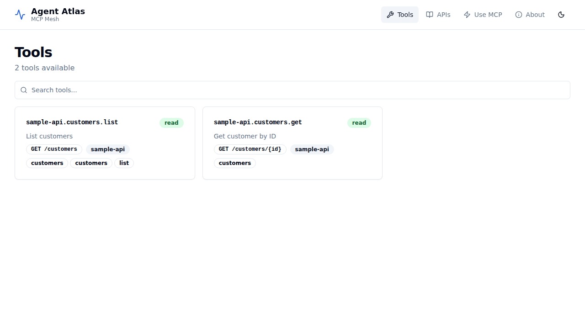

Each card shows:
- The stable tool ID (e.g. `sample-api.customers.list`)
- The **safety tier** badge: `read`, `write`, or `destructive`
- The HTTP method and path
- Tags and the owning API ID

Click any card to expand the **detail panel** showing full metadata — description, required downstream permissions, entitlement hint, and operation ID.

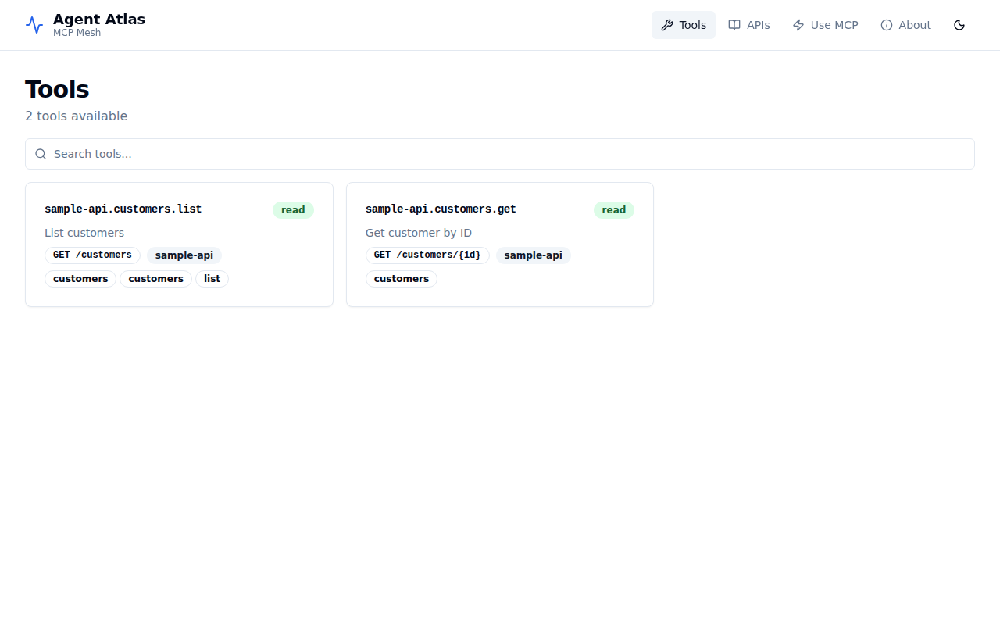
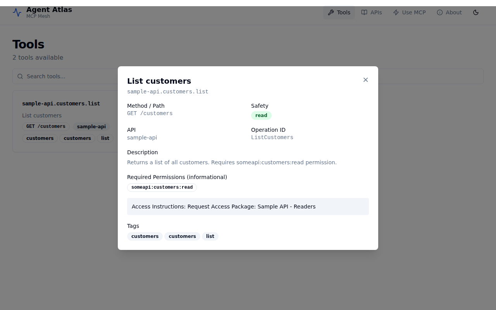

### APIs tab

The **APIs** tab lists every API registered in the catalog, with or without published tools.

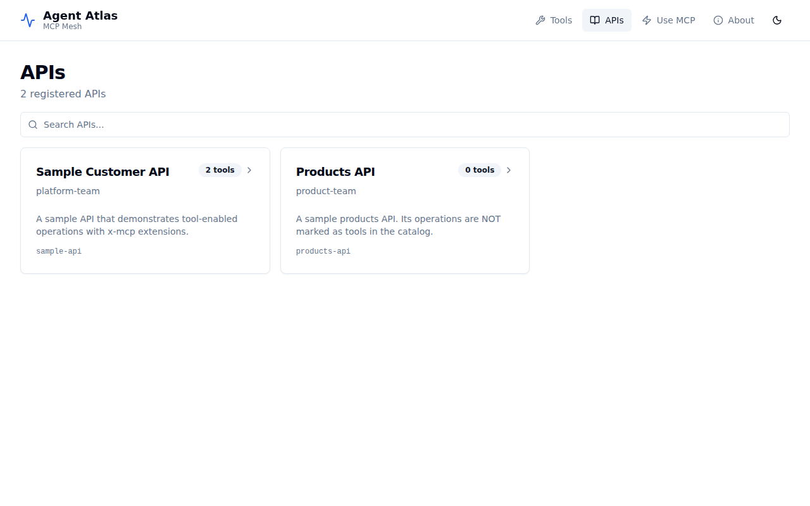

### Use MCP tab

The **Use MCP** tab provides ready-to-copy configuration snippets for VS Code (GitHub Copilot), Cursor, Claude Desktop, Claude Code, Windsurf, and M365 Copilot.

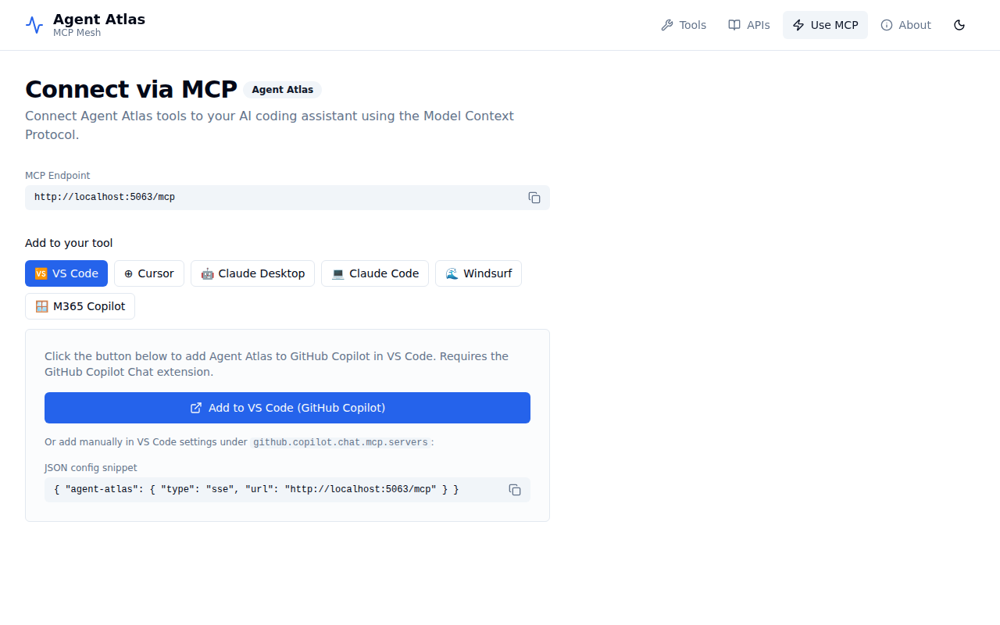

---

## 4. Get an access token from Keycloak

Atlas.Host requires a valid JWT with the `platform-code-mode:search` and `platform-code-mode:execute` scopes to call MCP tools.

When running via Aspire (with Keycloak), use the `atlas-mcp-client` service account:

```bash
# Retrieve the Keycloak token endpoint from the Aspire dashboard, e.g.:
TOKEN=$(curl -s -X POST \
  https://<keycloak-host>/realms/atlas/protocol/openid-connect/token \
  -d "grant_type=client_credentials" \
  -d "client_id=atlas-mcp-client" \
  -d "client_secret=atlas-mcp-secret" | jq -r .access_token)

echo "Token: ${TOKEN:0:40}..."
```

The `atlas-realm.json` pre-configures `atlas-mcp-client` with three default scopes:
- `platform-code-mode:search` — required to call `search_tools`
- `platform-code-mode:execute` — required to call `execute_plan`
- `someapi:customers:read` — downstream permission for the sample API

---

## 5. Connect MCP Inspector

When running the full Aspire stack, MCP Inspector starts automatically (at `http://localhost:6274`). It is pre-wired to connect to Atlas.Host's `/mcp` endpoint.

### Option A — Guided OAuth2 PKCE flow (recommended)

MCP Inspector supports a built-in guided OAuth2 flow. Atlas.Host advertises the Keycloak authorization server and the required scopes via the `WWW-Authenticate` challenge, so MCP Inspector can complete the entire PKCE exchange without any manual token copying.

**Step 1 — Configure the connection**

Open MCP Inspector. Set:

| Field | Value |
|-------|-------|
| **Transport Type** | Streamable HTTP |
| **URL** | Atlas.Host `/mcp` endpoint from Aspire dashboard (e.g. `http://localhost:5063/mcp`) |
| **Connection Type** | Direct |

Expand **Authentication → OAuth 2.0 Flow** and set:

| Field | Value |
|-------|-------|
| **Client ID** | `mcp-inspector` |
| **Client Secret** | *(leave empty — public PKCE client)* |
| **Redirect URL** | `http://localhost:6274/oauth/callback` |
| **Scope** | `openid platform-code-mode:search platform-code-mode:execute someapi:customers:read` |

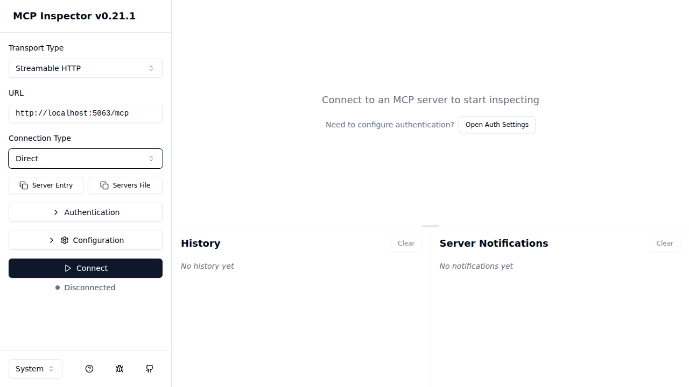

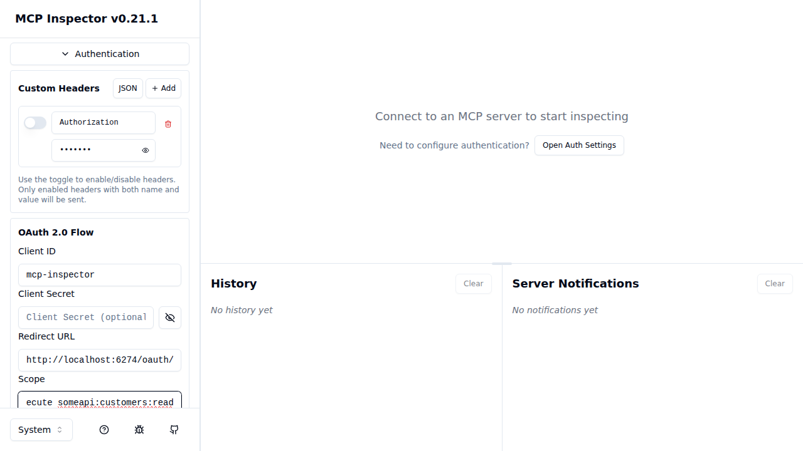

**Step 2 — Connect and authenticate**

Click **Connect**. Atlas.Host responds with `401 Unauthorized` and a `WWW-Authenticate` header pointing at the Keycloak realm. MCP Inspector reads the challenge, autodiscovers the Keycloak authorization endpoint, and opens the Keycloak login page.

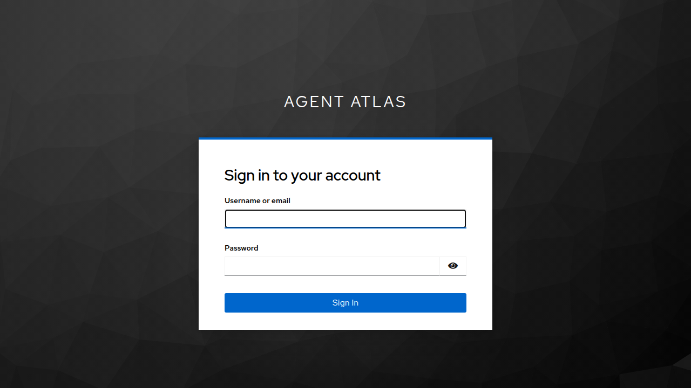

Sign in with the pre-configured developer account:

| Field | Value |
|-------|-------|
| **Username** | `developer` |
| **Password** | `developer` |

This account is created automatically by the realm import — no manual setup required. It belongs to the `atlas-developers` group and receives all three required scopes (`platform-code-mode:search`, `platform-code-mode:execute`, `someapi:customers:read`) from the `mcp-inspector` client's default scope configuration.

Complete the Keycloak login. MCP Inspector exchanges the authorization code for a token and retries the connection automatically. The status changes to **Connected**, Atlas.Host's server info appears, and a success notification confirms the guided PKCE flow completed.

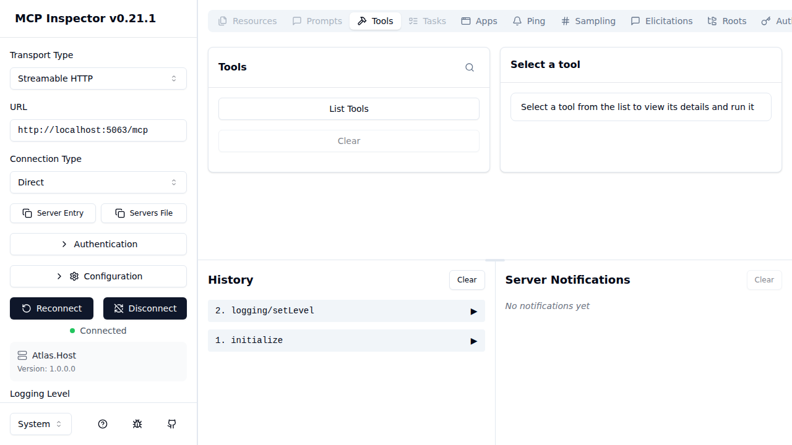

### Option B — Manual bearer token (M2M / scripted access)

Use the token obtained in section 4 (Get an access token from Keycloak). Expand **Authentication → Custom Headers** and add:

| Header | Value |
|--------|-------|
| `Authorization` | `Bearer <token from step 4>` |

Then click **Connect**. Atlas.Host validates the JWT and returns a session ID. The status changes to **Connected**.

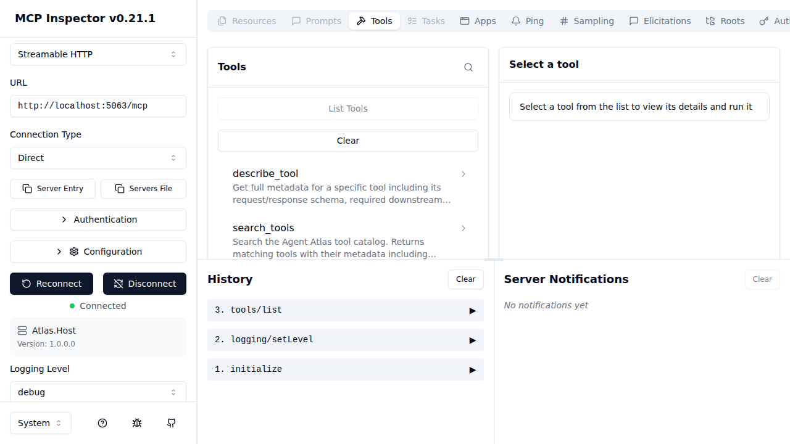

### Step 3 — List tools

Once connected, click **List Tools** to load the three Atlas MCP tools:
- `search_tools` — search the catalog
- `describe_tool` — get full metadata for a specific tool
- `execute_plan` — run a JSON plan against downstream APIs

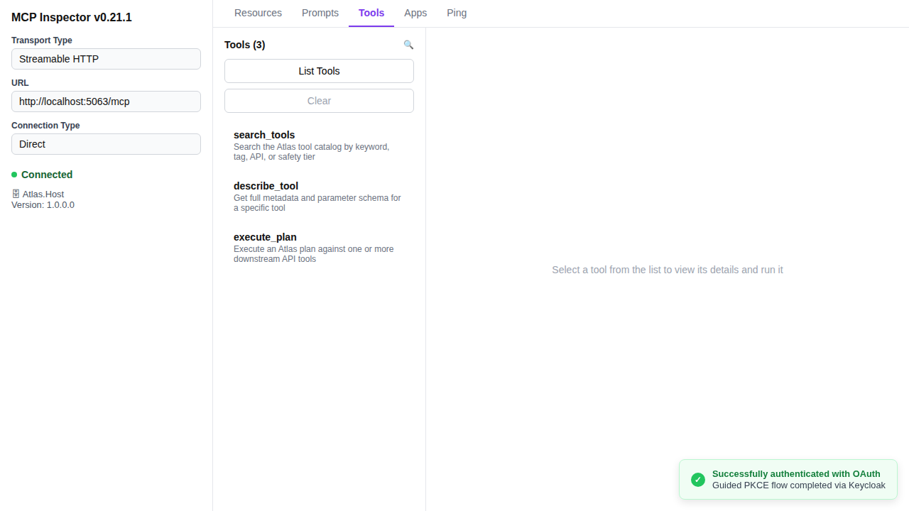

### Step 4 — Run `search_tools`

Select **search_tools** from the list. The right panel shows the tool's description, input schema, and safety annotations.

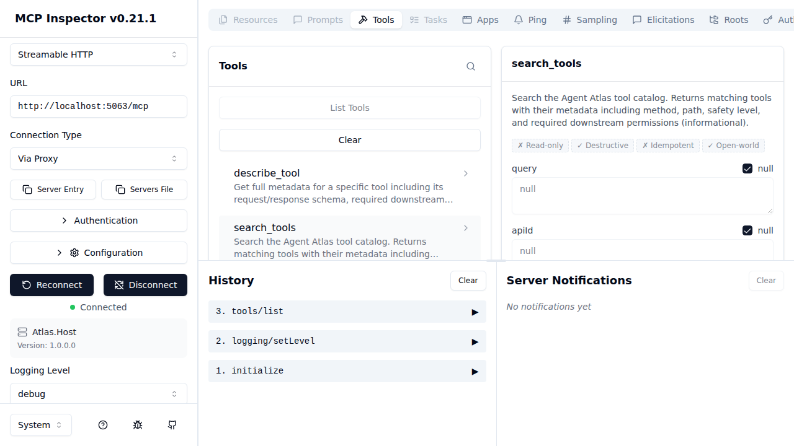

Leave all parameters as `null` to return all tools, then click **Run Tool**.

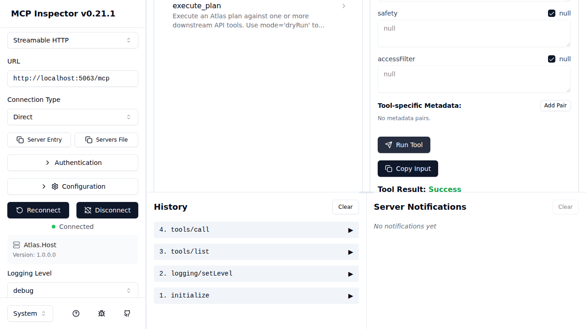

Atlas.Host responds with the full catalog. Each entry contains:
- `toolId` — stable identifier used in `execute_plan`
- `apiId`, `method`, `path` — routing metadata
- `safety` — read / write / destructive
- `requiredPermissions` — what the caller's JWT must contain for the downstream API
- `entitlementHint` — human-readable access request guidance

### Step 5 — Run `describe_tool`

Select **describe_tool** and enter a `toolId` (e.g. `sample-api.customers.list`). Click **Run Tool** to retrieve the full OpenAPI-derived schema for that operation, including the request body/parameter schema.

### Step 6 — Run `execute_plan`

Select **execute_plan** and provide a plan in the `plan` parameter. A minimal dry-run plan looks like:

```json
{
  "mode": "dryRun",
  "steps": [
    {
      "type": "call",
      "id": "list",
      "toolId": "sample-api.customers.list"
    }
  ]
}
```

Use `"mode": "dryRun"` first to validate the plan without making downstream HTTP calls. Switch to `"mode": "run"` to execute for real.

When `mode` is `"run"`, Atlas forwards the caller's JWT verbatim to every downstream API — this is the **JWT passthrough** mechanism. The downstream API receives exactly the same Bearer token the MCP caller presented to Atlas, enforcing the caller's own downstream permissions rather than a privileged service account.

> **Security note:** Because the JWT is forwarded as-is, the token must carry all permissions required by every downstream API in the plan. If the caller's JWT does not contain a permission expected by a downstream API (e.g. `someapi:customers:read`), that API will return `401` or `403` and the plan step will fail. Atlas does not mint or escalate tokens on behalf of callers.

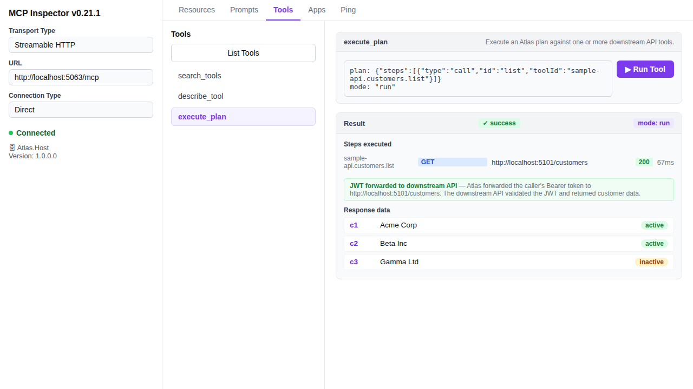

---

## 6. Using Atlas from an AI agent

Once you have verified the tools work in MCP Inspector, configure your AI assistant to point at the Atlas `/mcp` endpoint. The **Use MCP** tab in the Atlas UI provides the exact configuration snippets.

For GitHub Copilot in VS Code, add to `.vscode/mcp.json`:

```json
{
  "servers": {
    "agent-atlas": {
      "type": "http",
      "url": "https://<atlas-host>/mcp",
      "headers": {
        "Authorization": "Bearer ${env:ATLAS_TOKEN}"
      }
    }
  }
}
```

The agent can then call `search_tools` to discover available tools, `describe_tool` to understand schemas, and `execute_plan` to invoke them — all via the governed Atlas gateway.
