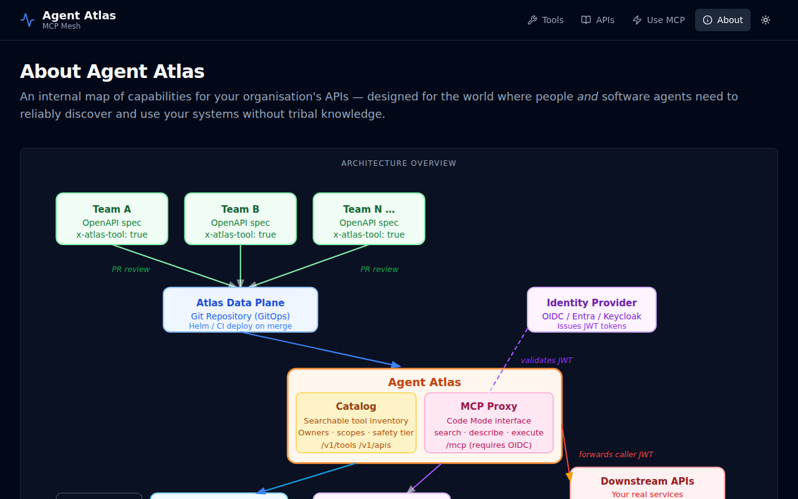

# UI Walkthrough

Agent Atlas ships a read-only React UI that serves as the **capability map** for your organisation — a single place for developers, operators, and AI agents to discover what tools are available, who owns them, and what access is required.

The UI is served from Atlas.Host at `/` and requires no authentication to browse (catalog read endpoints are open).

---

## Tools

The **Tools** tab lists every operation that has been published as an MCP tool via the `x-mcp` vendor extension in an OpenAPI spec.

Each card shows:
- The stable tool ID (e.g. `sample-api.customers.list`)
- The safety tier badge — **read**, **write**, or **destructive**
- The HTTP method and path
- The owning API ID
- Tags

### Tool detail

Click any card to open the detail panel. This shows the full tool metadata: description, required permissions, entitlement hint (telling users exactly how to request access), operation ID, and tags.

---

## APIs

The **APIs** tab lists every API registered in the catalog, whether or not any of its operations are published as tools. This gives operators a complete view of what is known to the system.

Each card shows:
- API display name and ID
- Owning team
- Description
- Tool count — how many operations from this API are exposed as MCP tools

---

## Use MCP

The **Use MCP** tab gives developers a quick-start guide to connecting their AI coding assistant to Agent Atlas. It shows the MCP endpoint URL and provides ready-to-copy configuration snippets for VS Code (GitHub Copilot), Cursor, Claude Desktop, Claude Code, Windsurf, and M365 Copilot.

---

## Dark mode

All views support light and dark themes. Toggle with the moon/sun icon in the top-right corner.

| Light | Dark |
|-------|------|
|  |  |
|  |  |
|  |  |

---

## About

The **About** tab contains a full explanation of the Agent Atlas architecture, the GitOps publishing model, the security design, and the strategic rationale. It includes a live SVG architecture diagram.

